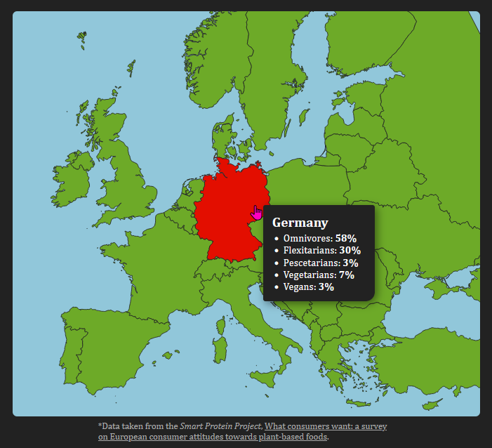

# Dietary preferences in Europe

https://diets-europe.netlify.app

This is a visualization of the dietary preferences in selected European countries. The data is taken from the _Smart Protein Project_, [What consumers want: a survey on European consumer attitudes towards plant-based foods](https://smartproteinproject.eu/wp-content/uploads/FINAL_Pan-EU-consumer-survey_Overall-Report-.pdf). The map is generated from data in the [Map of Europe](https://github.com/leakyMirror/map-of-europe) repository.

The visualization itself is made with [Svelte](https://svelte.dev/) and [D3](https://d3js.org/). On touch devices the data for each country is displayed under the map, otherwise the data is displayed in a floating card that follows the mouse.

The color of each country is an interpolation between red and green, depending on how many people tend towards a vegan diet. Regardless, we see that every country is colored in red ...
